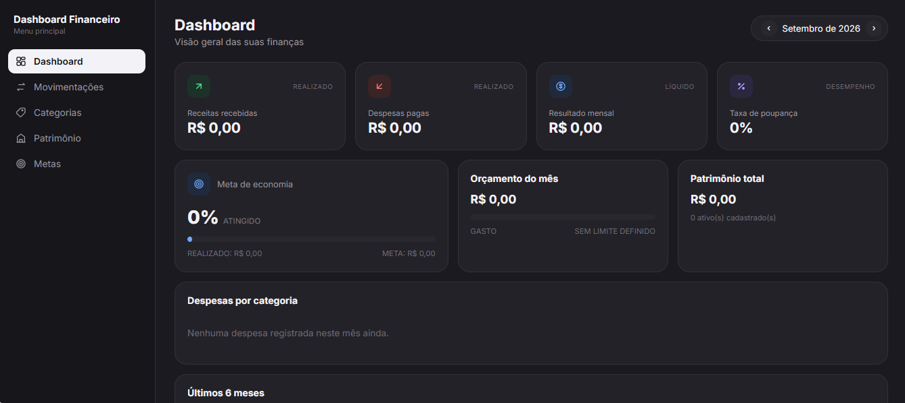
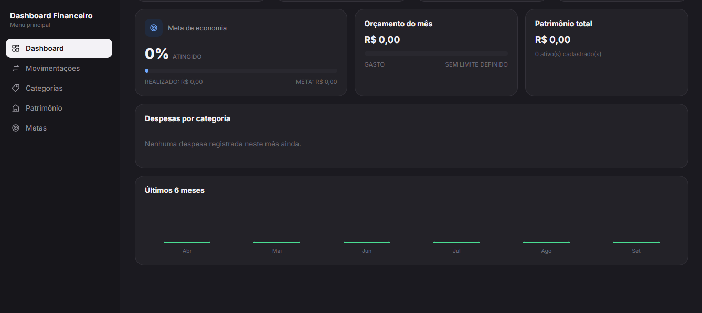

# 💰 Dashboard Financeiro

Um sistema completo, visual e intuitivo para organizar, acompanhar e controlar suas finanças pessoais — receitas, despesas, orçamento por categoria, patrimônio e metas de economia, tudo em um só lugar.

## 📌 Sobre o Projeto

Este projeto é um painel financeiro pessoal que permite registrar receitas e despesas, definir limites de orçamento por categoria, acompanhar seu patrimônio (contas, investimentos, bens) e estabelecer metas mensais de economia.

Com uma interface organizada em abas, você navega entre visão geral, movimentações, orçamento, patrimônio e metas, sempre com um seletor de mês para acompanhar a evolução das suas finanças ao longo do tempo.

## 🚀 Tecnologias Utilizadas

- 🏗 **HTML** → Estrutura da aplicação
- 🎨 **CSS** → Estilização, layout e responsividade (com menu lateral retrátil para mobile)
- 🎮 **JavaScript** → Lógica do sistema, navegação entre abas e interatividade
- 💾 **LocalStorage** → Armazenamento dos dados direto no navegador, sem necessidade de backend

## ✨ Funcionalidades

### 📊 Dashboard
- Resumo financeiro geral do mês selecionado
- Card de meta de economia, orçamento e patrimônio líquido
- Detalhamento de despesas por categoria
- Gráfico de evolução dos últimos 6 meses

### 💵 Movimentações
- Cadastro de receitas e despesas com data, valor, descrição e categoria
- Listagem das movimentações do mês
- Alternância rápida entre tipo "Despesa" e "Receita"

### 🏷️ Categorias / Orçamento
- Definição de limite mensal de gastos por categoria
- Acompanhamento do progresso de cada orçamento conforme o mês avança

### 🏦 Patrimônio
- Cadastro de ativos (conta corrente, poupança, investimentos, imóveis, outros)
- Cálculo automático do patrimônio total

### 🎯 Metas
- Definição de meta mensal de economia (receitas − despesas)
- Acompanhamento detalhado do progresso da meta

### 📱 Extras
- Navegação por mês (mês anterior/próximo)
- Layout responsivo, com menu lateral adaptado para celular
- Interface limpa, sem dependência de frameworks externos

## 🎮 Como Usar?

1. Acesse a aba **Movimentações** e registre suas receitas e despesas (valor, data, descrição e categoria).
2. Vá em **Categorias** e defina limites de orçamento para cada categoria de gasto.
3. Em **Patrimônio**, cadastre suas contas, investimentos e bens para acompanhar seu patrimônio total.
4. Em **Metas**, defina quanto você quer economizar por mês.
5. Use o seletor de mês no topo para navegar entre períodos e acompanhar sua evolução no **Dashboard**.

## 📷 Demonstração

## 🎯 Objetivo

O objetivo deste projeto é facilitar o controle das finanças pessoais de forma completa: não só quanto entra e sai, mas também quanto você tem guardado (patrimônio), quanto pretende gastar (orçamento) e quanto quer economizar (metas) — tudo em uma interface simples e direto no navegador, sem necessidade de cadastro ou servidor.

> ⚠️ Os dados são salvos localmente no navegador (localStorage). Isso significa que eles não são sincronizados entre dispositivos e podem ser perdidos se o cache do navegador for limpo.
